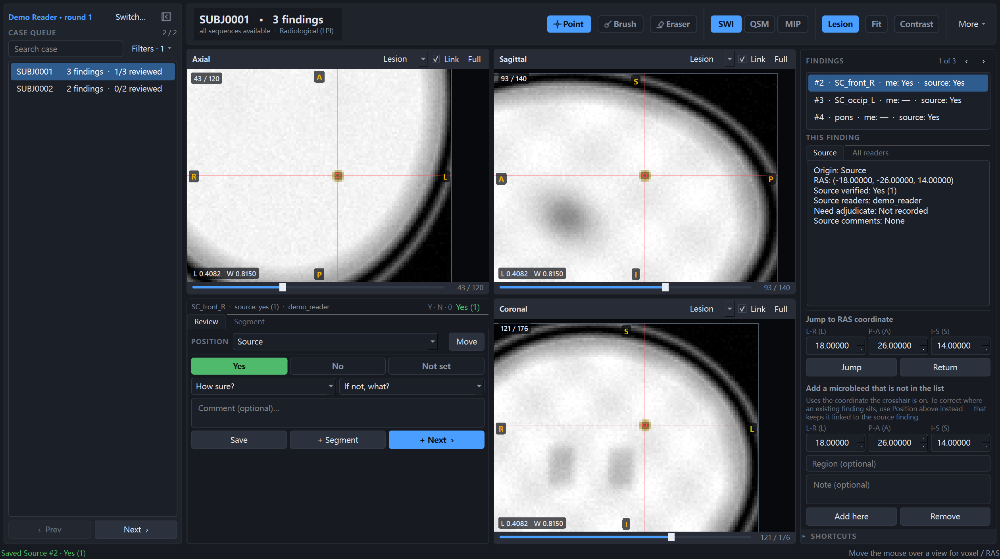
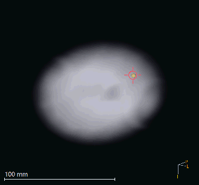
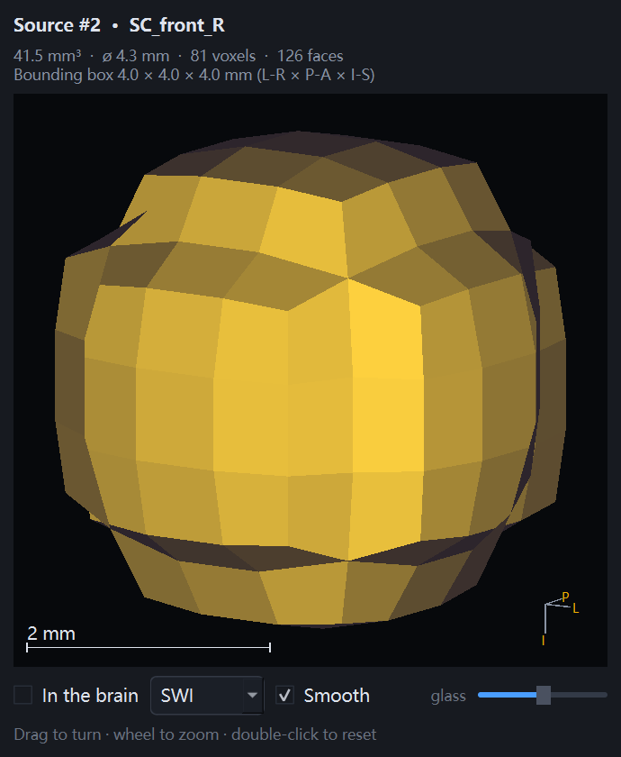

# Microbleed Review Viewer

A desktop tool for the second pass over a cerebral microbleed candidate list:
confirm each finding, correct where it sits, and segment it — on SWI, QSM and
SWI MIP, in physical coordinates, with everything a reader does recorded
per reader and per round.

Built with PySide6, numpy and nibabel. No GPU, no server, no cloud.



*Every image on this page is of the synthetic phantom in `examples/`, not of
anybody's scan.*

## What it is for

A candidate list from an automated or prior manual pass arrives as a
spreadsheet of RAS coordinates. Someone has to open each one, decide whether it
is a microbleed, fix the coordinate when it is real but mislocated, and outline
it. This is the tool for that loop, built around how it actually runs: in the
dataset it was written for, 69% of cases hold a single finding, so the loop is
*open case → judge one lesion → next case*, and the keyboard does all of it.

## Install and run

**No Python needed.** Download `MicrobleedReviewViewer-windows-x64.zip` from
[Releases](../../releases), unzip it anywhere, and run
`MicrobleedReviewViewer.exe`. It keeps `config.json` and, unless you point it
elsewhere, its review database in its own folder, so the whole thing travels on
a memory stick.

From source instead — Windows, Python 3.12+:

```powershell
.\install.bat                       # creates a venv outside any synced folder
copy local.example.ps1 local.ps1    # then edit it to point at your dataset
.\run_app.bat
```

`local.ps1` sets three paths — the findings workbook, the MRI folder and the
review database. The same three can be given as `MICROBLEED_SOURCE_XLSX`,
`MICROBLEED_DATA_ROOT` and `MICROBLEED_REVIEW_DB`, or chosen in the app.

Input format, with a working example file: [`examples/`](examples/README.md).

## Your data, not ours

Nothing about the study this was written for is compiled in. What the sheet is
called, what its columns are called, how the NIfTI files are named and which
sequences a case must have all live in `config.json` — and there is no need to
write one by hand.

Open **More ▾ → Dataset…**, expand **Format of this dataset**, and press
**Detect from the data folder**. A sequence is recognised by the *end* of its
filename, and nobody remembers their own, so the app reads a sample of case
folders and works out which endings they share. Pick one per sequence, name
them, say which are required, and the choice is written to `config.json` for
next time.

By hand, copy `config.example.json` and change what differs — anything you
leave out keeps its default, and `_comment` keys are ignored so the file can
explain itself:

```jsonc
{
  "workbook": {
    "sheet": "Findings",
    "columns": { "case_id": "subject", "ras_l": "x", "ras_p": "y", "ras_s": "z",
                 "verify": "is_bleed" }
  },
  "sequences": {
    "swi": { "label": "SWI",  "suffix": "_SWI.nii.gz",  "required": true },
    "qsm": { "label": "QSM",  "suffix": "_QSM.nii.gz",  "required": true },
    "mip": { "label": "T2*",  "suffix": "_T2star.nii.gz", "required": false }
  }
}
```

Three sequence slots, because there are three toolbar buttons and three
shortcuts; everything about each one is yours. `required: false` means a case
without it is still readable — the projection is optional by default, since it
helps you spot a lesion and takes no part in anything after that.
`segmentable: false` means no mask may be drawn on it, which is right for a
projection: it smears a microbleed along the projection direction, about seven
times on the data this was written for, so a mask drawn there would be a mask
of an artefact.

A configuration that cannot work is refused when it is loaded, with the reason
— an empty sheet name, a column that does not exist, no required sequence at
all. Every one of those otherwise produces a viewer that starts and then shows
nothing, with no clue why.

## The reading loop

1. A case opens on SWI with the finding centred at a fixed field of view in
   millimetres, so a lesion is the same size in every case and every sequence.
2. `1` `2` `3` switch sequence without losing zoom, pan or slice.
3. The wheel scrolls slices — of the view under the mouse only, so you can
   scroll off a focus to see whether it is a lesion or a vessel.
4. `Y` `N` `0` record the verdict, `Ctrl+S` saves and moves to the next finding
   — or the next case once this one is done.

Every key is rebindable, and the legend in the window always shows the live
bindings rather than a printed guess.

### Where it is

A reader's opinion is three things: the verdict, the comment, and where the
finding actually is. Pick the true point with the **Point** tool and press
**Move**; the source coordinate is never modified, both stay inspectable, and
the export reports how far each reader moved it. Selecting another reader's
position to look at it is not an edit and does not mark anything unsaved.

### Segmenting it

**Brush** and **Eraser** paint in millimetres, so the stamp stays round on
anisotropic voxels, and a stroke is stamped along its whole path rather than at
the points the mouse happened to report.

**Generate** grows the mask from the finding against a threshold taken from the
local background, capped inside a sphere so it cannot run away along a vessel.
**Grow stroke** starts from a scribble instead, for irregular lesions. Neither
is offered on the MIP: a projection smears a microbleed along the projection
direction — measured at about seven times on this data — so a mask drawn there
would be a mask of an artefact.

A verdict of *no* locks the segmentation tools. A mask stored against "not a
microbleed" is a contradiction that would travel into the exported table with
nothing downstream able to tell which half to believe.

### Seeing it in three dimensions

The **3D** button opens the selected mask in a window of its own: drag to turn,
wheel to zoom. Blocky by default, because the point is to see what is stored —
whether the grower slipped down a vessel, whether a stroke is one slice thick —
with a **Smooth** switch for when roundness is the question.

**In the brain** puts it back where it sits, inside a see-through head built
from whichever sequence you choose, with every other segmented finding of the
case alongside it. Lobar against deep is a statement about the pattern, and
that is hard to assemble from three slice views.

<p align="center">
  
  
</p>

It is software-rendered: no OpenGL, because reading rooms are where remote
desktops and software rasterisers live. A 5 mm lesion is 486 faces and 2.1 ms
a frame.

## Try it without your own data

```powershell
python examples/make_demo_data.py --open
```

That writes a phantom head with a few dark spots standing in for microbleeds,
and a findings workbook pointing at them — two cases, five findings, enough to
click through the whole loop. It prints the three environment variables to set;
then `.\run_app.bat`. Nothing in it comes from a scan of anybody, which is why
the pictures above could be published.

## Multiple readers

Give each reader their own database — the dataset dialog makes that one field —
rather than sharing one SQLite file on a synced drive, where concurrent writers
lose work. Then combine:

```powershell
python merge_reviews.py --target merged.sqlite `
    --workbook findings.xlsx --data-root Data `
    --source reviews_a.sqlite --source reviews_b.sqlite `
    --export combined.xlsx
```

Merging is repeatable and never overwrites: if two databases both used round 1,
the second is renumbered so both survive.

The export has one row per finding with a column block per reader and an
agreement column, a long form with every review, one row per segmented finding
with its volume and centroid, and a pairwise agreement table (Dice, volume
ratio, centroid distance) for the findings two readers both outlined.

## Data safety

- The source workbook is copied to a local snapshot at launch and never
  written to.
- A label file is written to a neighbour and renamed over the target, so an
  interrupted write cannot destroy the masks already in it. One file holds
  every finding of a case.
- The review database is SQLite in WAL mode; log writes go to a background
  thread with a short timeout so they can never freeze the window, while a
  reader's save keeps the full timeout because it has to be told the truth.
- The viewer warns if the database is in a synced folder.

## Tests

```powershell
$env:QT_QPA_PLATFORM = 'offscreen'
python -m unittest tests.test_core tests.test_desktop_app
```

Like that, 42 tests run — the geometry, the region growing, the surface and
projection maths, the store — and the rest are held back as needing a dataset.
Point it at a study and the whole suite runs:

```powershell
$env:TEST_SOURCE_XLSX = 'C:\studies\findings.xlsx'
$env:TEST_DATA_ROOT   = 'C:\studies\Data'
python -m unittest tests.test_core tests.test_desktop_app
```

A study, not the demo phantom: several of these were written against real
acquisitions and assume things the phantom does not have — more than one case
per finding list, a full-size matrix, tissue texture for the interpolation
checks. The phantom is for driving the application, not for satisfying the
suite.

Most of these exist because something was measured: the figures quoted above
are in the suite as the thresholds it asserts.

## Building the standalone application

```powershell
python -m pip install pyinstaller
python build_exe.py
```

That writes `dist/MicrobleedReviewViewer/` and a zip beside it — about 150 MB
unpacked, 60 MB zipped, most of it Qt. PyInstaller is not in
`requirements.txt`: it is needed to make the build, never to run it.

One folder rather than one file. A single-file build unpacks itself to a
temporary directory on every launch, which for a Qt application is several
seconds each time and reads as a hang.

## Licence

MIT.
